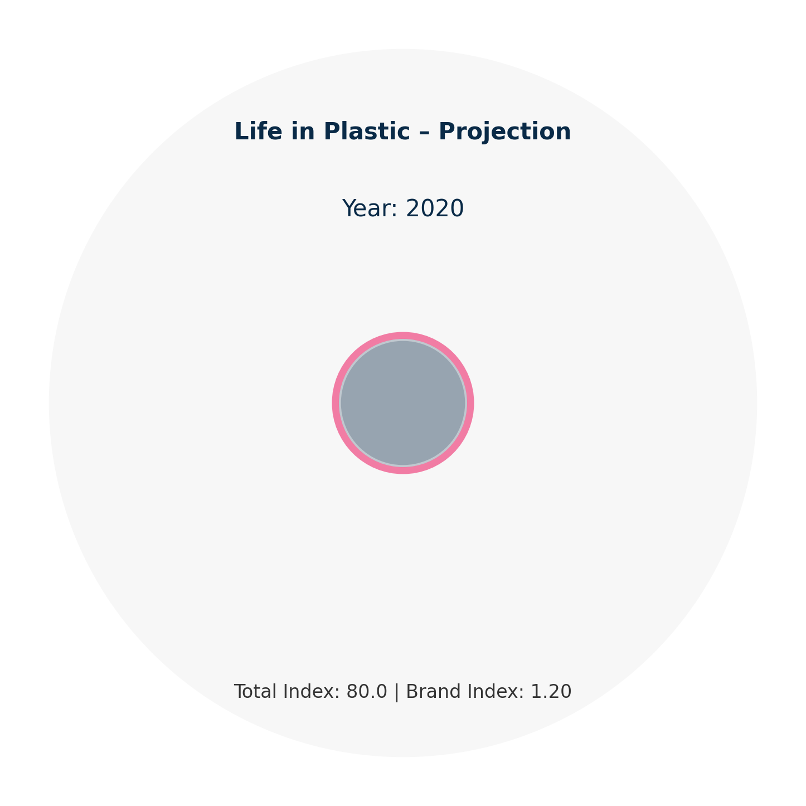
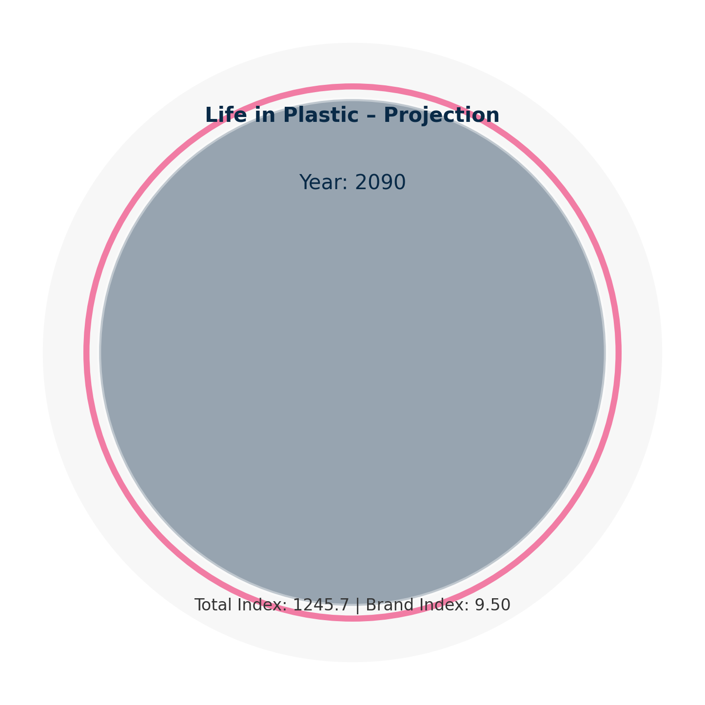

# DataArt – Life in Plastic 
*A visual data story about growth, consumption, and sustainability.*

This project transforms environmental growth data into a **data-art style visualization**.  
Using simple geometric forms and smooth animation, it depicts the accelerating expansion  
of plastic production over time — a metaphor for consumption and environmental impact.  

---

## Project Overview

- **Goal:** Communicate data insights through minimalist, emotionally resonant visualization  
- **Focus:** Visual storytelling, scaling data, and dynamic representation of change over time  
- **Concept:**  
  - Expanding **blue circle** → total global plastic index  
  - Pulsing **pink ring** → brand-specific plastic growth  
  - Gradual expansion to 2090 → future projection scenario  

---

## Methods & Tools

| Category | Description |
|-----------|--------------|
| **Framework** | Python (Matplotlib Animation) |
| **Visualization** | Circular growth metaphor (no map/cartopy) |
| **Animation Export** | MP4 (via FFMpeg) or GIF (via Pillow fallback) |
| **Output** | 2 static frames + 1 animation |

---

## Key Visuals

| Visualization | Description |
|----------------|-------------|
| **Start Frame (2020)** | Initial state – small plastic footprint |
| **End Frame (2090)** | Projected expansion and acceleration |
| **Animated Projection** | Smooth transition from 2020–2090 |

  
  

**Animation Preview (MP4 / GIF)**  
> *(Click below to open the animation)*  
[View animation](reports/life_in_plastic.mp4)
> [High-quality MP4](reports/life_in_plastic.mp4

